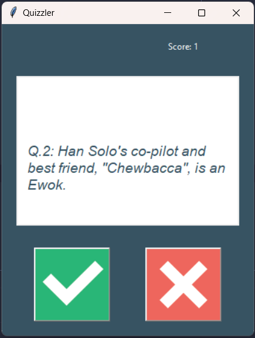

# Simple GUI Quiz Application

Welcome to the Simple GUI Quiz Application repository! This project is a simple quiz application developed using Python. The questions are generated by the Open Trivia DB API, and the user interface is built using the Tkinter library. Users will be presented with 10 true or false questions, and their final score will be revealed at the end of the quiz.

## Overview

The Simple GUI Quiz Application provides users with an interactive and engaging way to test their knowledge. With questions fetched from the Open Trivia DB API and a user-friendly interface created with Tkinter, this quiz app offers an enjoyable experience for users of all levels.



## Features

- **Open Trivia DB Integration:** Fetches true or false questions from the Open Trivia DB API to ensure a variety of content.

- **User-Friendly Interface:** The quiz interface is developed using Tkinter, making it intuitive and easy to navigate.

- **Simple True or False Questions:** Users are presented with 10 true or false questions to answer within a limited time frame.

- **Instant Feedback:** Users receive immediate feedback after answering each question, along with their current score.

## Getting Started

To run the Simple GUI Quiz Application locally, follow these steps:

1. **Clone the Repository:** `git clone https://github.com/rohan-4761/quiz-app.git`

2. **Navigate to Project Directory:** `cd quiz-app`

3. **Run the Application:** Start the quiz application by running the Python script:

   ```bash
   python main.py
   ```

4. **Take the Quiz:** Answer the true or false questions presented by the application. Your final score will be revealed at the end of the quiz.

## Credits

This project utilizes the Open Trivia DB API for fetching questions and the Tkinter library for building the graphical user interface. Special thanks to the developers of these tools for their contributions.

---

Test your knowledge and have fun with the Simple GUI Quiz Application! Whether you're looking to challenge yourself or simply pass the time, this quiz app is sure to provide an enjoyable experience. Feel free to explore, contribute, and share your high scores!